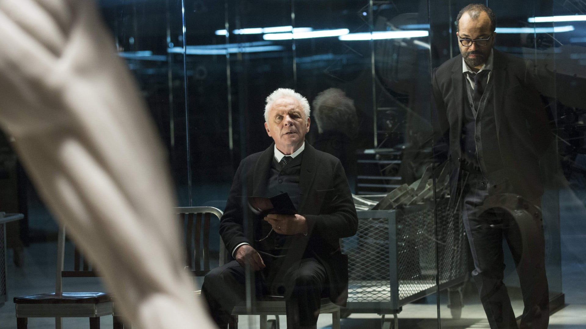
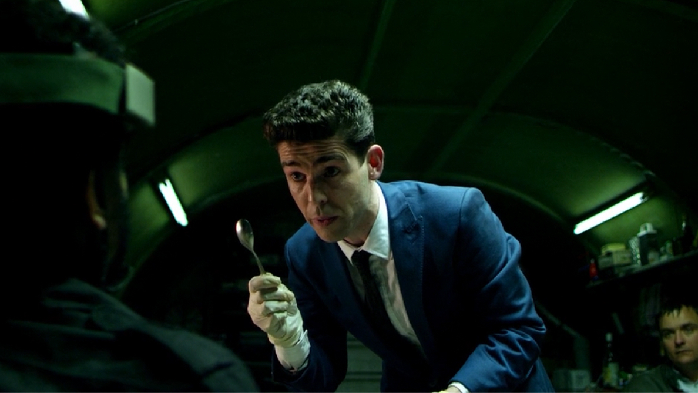
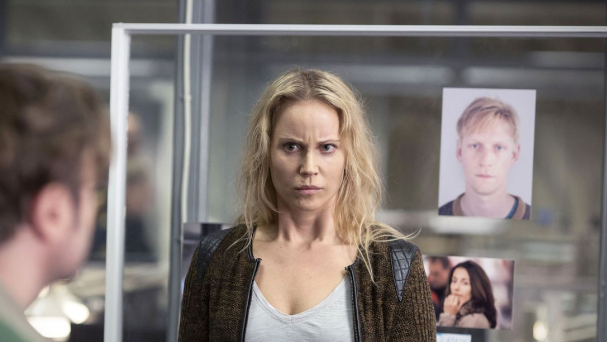
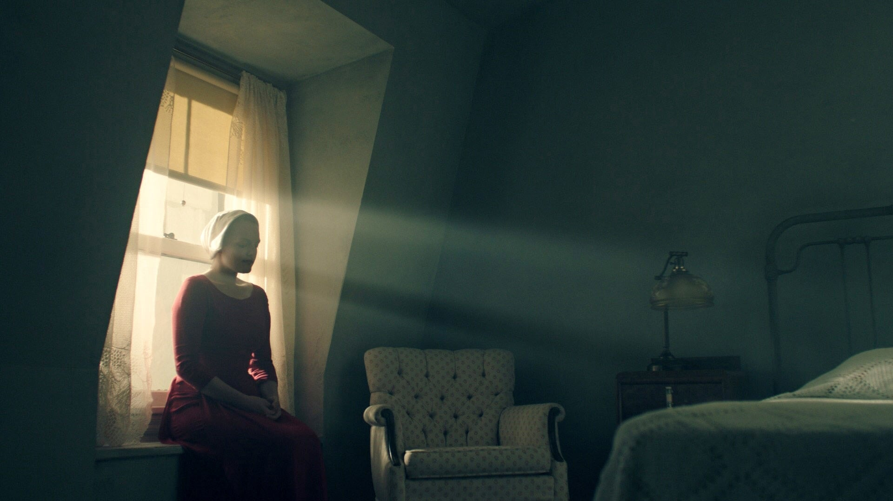

import Film from '../../../src/components/Film';
import FilmCover from '../../../src/components/FilmCover';
import Grid from '../../../src/components/Grid';

<Film cover="./covers/westworld_cover.jpg" title="Westworld" year="2016" genre="Western, Science Fiction" rating={4.5}>

 Enjoy gripping narratives,
beautifully constructed characters and intricate plotlines in a Tv show no one
should be without. It is one of those shows you wish you could relive. Set at
the intersection of the near future and the reimagined past Westworld explores a
world in which every human appetite no matter how noble or depraved, can be
indulged.

</Film>

<Film cover="./covers/utopia_cover.jpg" title="Utopia" year="2013" genre="Drama, Mystery, Action & Adventure" rating={4.5}>

 By far one of the most original and
unappreciated shows out there with an incredible soundtrack from Cristobal Tapia
de Veer. When five strangers from an online comic book forum agree to meet after
gaining possession of the original manuscript for the cult graphic novel 'The
Utopia Experiments', they find themselves pursued by a shadowy organisation
known as The Network. A relatively unknown cast even now, but that makes for a
more authentic experience.

</Film>

<Film cover="./covers/black-mirror_cover.jpg" title="Black Mirror" year="2011" genre="Sci-Fi & Fantasy, Drama" rating={4.5}>

 More than anything,
Charlie Brooker is what makes this show as good as it is, even now I find myself
rewatching episodes to sit in awe of its brilliance. Each story is in turn,
disarming, suspenseful and darkly satirical, tapping into our collective unease
with the modern world. Each stand-alone episode a sharp, suspenseful tale
exploring themes of contemporary techno-paranoia.

</Film>

<Film cover="./covers/broen-bron_cover.jpg" title="Broen Bron" year="2011" genre="Crime, Mystery" rating={4.5}>

 To me, Saga Norèn is one of
those characters that you instantly love even though she comes across lacking in
social skills, insensitive and blunt. Saga and Martin Rohde are everything you
could ask for in a team of detectives and nothing comes close to their
chemistry. When a body is found on the bridge between Denmark and Sweden, right
on the border, Danish inspector Martin Rohde and Swedish Saga Norén have to
share jurisdiction and work together to find the killer.

</Film>

<Film cover="./covers/handmaids-tale_cover.jpg" title="The Handmaids Tale" year="2017" genre="Sci-Fi & Fantasy, Drama" rating={4.5}>

 Handmaids tale stands
as one of the most thought-provoking, brutally devastating shows out there.
Elisabeth Moss is incredible in it and even though it slightly differs from the
book they have done it more than justice. Handmaids Tale follows June who is
forced to live as a concubine under a fundamentalist theocratic dictatorship.
Separated from her family and subjected to tortuous norms June seeks freedom and
change.

</Film>

<h3>More shows to appreciate</h3>

<Grid
  gridTemplateColumns="repeat(auto-fill, minmax(110px, 1fr))"
  gridGap="1rem"
>
  <FilmCover
    cover="./covers/dark_cover.jpg"
    year="2017"
    genre="Sci-Fi & Fantasy, Drama, Mystery"
    rating={4.5}
  />
  <FilmCover
    cover="./covers/house_of_cards_cover.jpg"
    year="2013"
    genre="Drama"
    rating={4.5}
  />
  <FilmCover
    cover="./covers/mr_robot_cover.jpg"
    year="2013"
    genre="Crime, Drama"
    rating={4.5}
  />
  <FilmCover
    cover="./covers/better_call_saul_cover.jpg"
    year="2015"
    genre="Comedy, Crime, Drama"
    rating={4.5}
  />
  <FilmCover
    cover="./covers/true_detective_cover.jpg"
    year="2014"
    genre="Drama"
    rating={4.5}
  />
  <FilmCover
    cover="./covers/vikings_cover.jpg"
    year="2013"
    genre="Action & Adventure, Drama "
    rating={4.5}
  />
  <FilmCover
    cover="./covers/hannibal_cover.jpg"
    year="2013"
    genre="Drama"
    rating={4.5}
  />
  <FilmCover
    cover="./covers/chernobyl_cover.jpg"
    year="2019"
    genre="Drama"
    rating={4.5}
  />
  <FilmCover
    cover="./covers/tales_from_the_loop_cover.jpg"
    year="2020"
    genre="Drama, Mystery, Sci-Fi & Fantasy"
    rating={4.5}
  />
  <FilmCover
    cover="./covers/money_heist_cover.jpg"
    year="2017"
    genre="Crime, Drama"
    rating={4.5}
  />
  <FilmCover
    cover="./covers/end_of_the_cover.jpg"
    year="2017"
    genre="Comedy, Crime, Drama"
    rating={4.5}
  />
  <FilmCover
    cover="./covers/fleabag_cover.jpg"
    year="2016"
    genre="Comedy, Drama"
    rating={4.5}
  />
  <FilmCover
    cover="./covers/unorthodox_cover.jpg"
    year="2020"
    genre="Drama"
    rating={4.5}
  />
  <FilmCover
    cover="./covers/fargo_cover.jpg"
    year="2014"
    genre="Crime,Drama"
    rating={4.5}
  />
</Grid>
