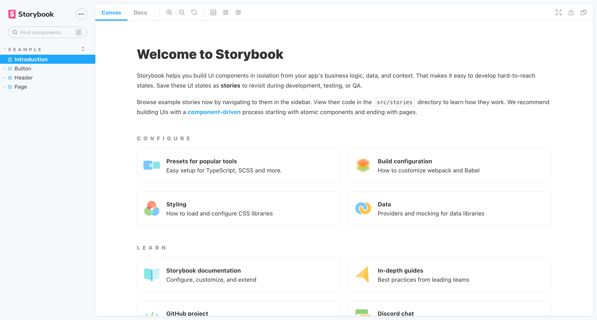
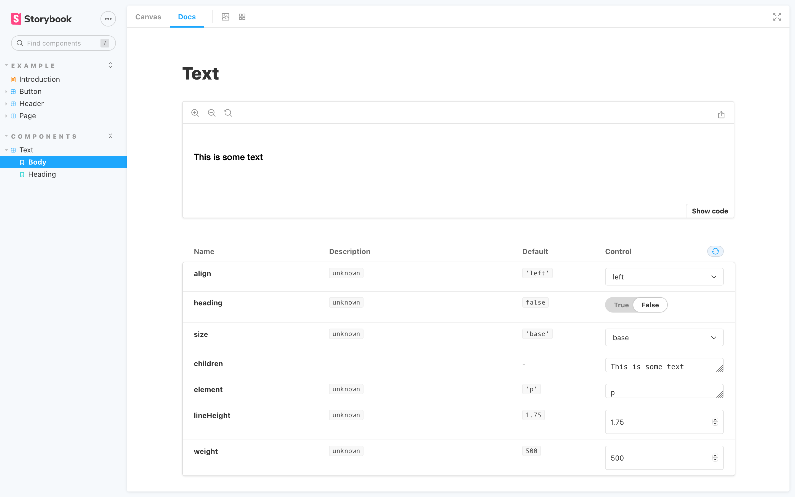
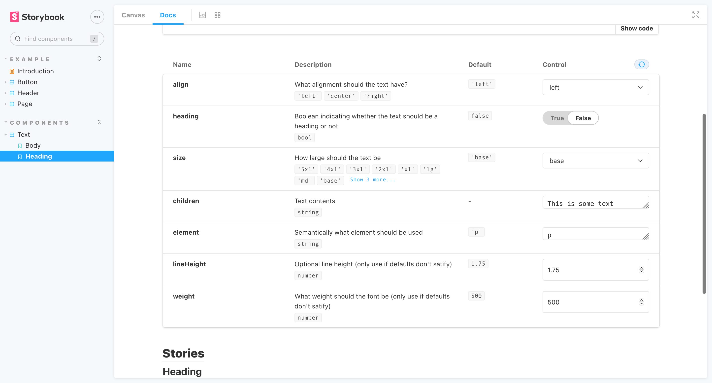

I'd be lying if I said I wasn't a little obsessed with Vite at the moment. Every small project or jaunty experiment I find myself installing it, seeing what it's capable of. More than anything it's the experience that excites me. Focusing on blazingly fast (everyone loves this term) starts/builds, the dev experience and the ability to import ES Modules, it's nothing short of sublime. For me, this is everything I want in a development environment and it makes Create React App feel sluggish and bloated in comparison. Not to mention it supports multiple frameworks! (React, Vue, Svelte, Preact and Lit at the time of writing). Evan You has outdone himself here and as a relatively young project, it's only going to get better.

Even though Storybook exists as its own "project within a project" I thought it would be interesting to see it within the Vite development environment (set up for React), rather than Create React App. In the future, I'd love to see ESBuild or Vite used as a bundler for Storybook and it seems this is already in the [early stages](https://storybook.js.org/blog/storybook-6-2/). If this does come to fruition we could see some really impressive start/build times and working with Storybook could become a simpler/more productive experience. A little disclaimer here that this will be React focused, however, I will point out when other frameworks can be used. Also, we will be using Styled Components to create out styles.

Now back to the task at hand...

### Installing Vite

`npm init @vitejs/app`

Give the project a name, I went with `vite-storybook`

You'll notice next that you can select a framework. This is one thing that Vite has got right in my opinion, creating a simple/powerful dev experience that's also flexible. For this post though let's go with React.

Select React > Javascript (or typescript if you prefer that)

```jsx
$ cd vite-storybook
$ npm install
$ npm run dev
```

What is created in our directory:

```jsx
.
├── index.html
├── package.json
├── src
│   ├── App.css
│   ├── App.jsx
│   ├── favicon.svg
│   ├── index.css
│   ├── logo.svg
│   └── main.jsx
└── vite.config.js
```

Now let's open the project in our code editor (I will be using VS Code):

```jsx
code .
```

### Installing Storybook

```jsx
# Add Storybook:
# Notice how we are using npx here instead of npm i
npx sb init
```

Now this will install everything we need for Storybook to work. You'll notice in the [docs](https://storybook.js.org/docs/react/get-started/install/) that Storybook can't be installed on its own, it needs to bootstrap an already existing project which uses a framework. In this case, it will bootstrap React since our `vite.config.js` is set up to use the React framework. Alternatively, you could set Storybook up to use something like Svelte or Vue by selecting a different framework when running `npm init @vitejs/app`. See the options available in [Vite's docs](https://vitejs.dev/guide/#scaffolding-your-first-vite-project) and make sure Storybook supports that framework.

Here's how our project files look after Storybook has been added. Notice the additions of the `.storybook` directory and the `stories` directory in `src`.

You will see a few default components exist in `src/stories` which we can reference in creating stories of our own. You'll notice that everything is kept one level deep in `src/stories`, personally I prefer creating a folder for each component and keep everything relating to that component within that space. I remember finding Robin Wieruch's blog post [React Folder Structure in 5 Steps](https://www.robinwieruch.de/react-folder-structure) useful a while back if you're looking for a good reference.

```jsx
.
├── .storybook
│   ├── main.js
│   └── preview.js
├── index.html
├── node_modules
├── package-lock.json
├── package.json
├── src
│   ├── App.css
│   ├── App.jsx
│   ├── favicon.svg
│   ├── index.css
│   ├── logo.svg
│   ├── main.jsx
│   └── stories
│       ├── Button.js
│       ├── Button.stories.js
│       ├── Header.js
│       ├── Header.stories.js
│       ├── Introduction.stories.mdx
│       ├── Page.js
│       ├── Page.stories.js
│       ├── assets
│       ├── button.css
│       ├── header.css
│       └── page.css
└── vite.config.js
```

Now we can run `npm run storybook` to get us up and running. You'll find that it does quite a lot of work in the terminal to get started, and this is where we will probably see some improvements in the future.

Here's an example of what's rendered for us:



### Custom Component Setup

As mentioned previously in the article we will be using styled-components for our styles, so let's get it installed in our project.

`npm i styled-components`

Now we can strip back our stories folder, create a Text directory and within that create an `index.jsx` and `Text.stories.js` file. It's worth mentioning that even though we have altered the structure of our stories folder, Storybook does a blanket "search" for any `.stories.js` files, so it'll still function the same.

```jsx
.
├── .storybook
│   ├── main.js
│   └── preview.js
├── index.html
├── node_modules
├── package-lock.json
├── package.json
├── src
│   ├── App.css
│   ├── App.jsx
│   ├── favicon.svg
│   ├── index.css
│   ├── logo.svg
│   ├── main.jsx
│   └── stories
│       └── Text
│           ├── index.jsx
│           └── Text.stories.js
└── vite.config.js
```

Originally I was going to create a story for a really basic component but I thought it made more sense to show a "real case scenario". Therefore, here's a Text component I've pulled from a recent project (this lives in Text > index.jsx)

```jsx
import React from 'react';
import styled, { css } from 'styled-components';

const TextElement = styled.p`
  --text-5xl: 64px;
  --text-4xl: 48px;
  --text-3xl: 36px;
  --text-2xl: 30px;
  --text-xl: 24px;
  --text-lg: 20px;
  --text-md: 18px;
  --text-base: 16px;
  --text-sm: 14px;
  --text-xs: 12px;
  --text-xxs: 10px;

  line-height: ${(props) => (props.heading ? 1.3 : props.lineHeight)};
  font-weight: ${(props) => (props.heading ? 600 : props.weight)};
  font-family: ${(props) =>
    !props.heading && `"Helvetica Neue", Arial, sans-serif`};
  color: inherit;

  ${(props) =>
    props.heading &&
    css`
      font-family: 'HelveticaNeue-CondensedBold', 'HelveticaNeueBoldCondensed',
        'HelveticaNeue-Bold-Condensed', 'Helvetica Neue Bold Condensed',
        'HelveticaNeueBold', 'HelveticaNeue-Bold', 'Helvetica Neue Bold',
        'Helvetica Neue', 'Oswald', Arial, sans-serif;
      font-stretch: condensed;
      text-transform: uppercase;
      letter-spacing: 0.02em;
    `}

  & + * {
    margin-top: ${(props) => props.spacing || '1.45rem'};
  }

  @media (max-width: 767px) {
    --text-5xl: 48px;
    --text-4xl: 36px;
    --text-3xl: 30px;
    --text-2xl: 24px;
    --text-xl: 20px;
    --text-lg: 18px;
    --text-md: 16px;
    --text-base: 14px;
    --text-sm: 12px;
    --text-xs: 10px;
    --text-xxs: 8px;
  }
`;

export const Text = (props) => {
  const {
    element,
    children,
    size,
    align,
    heading,
    className,
    lineHeight,
    weight,
    spacing,
  } = props;

  return (
    <TextElement
      as={element}
      style={{ fontSize: `var(--text-${size})`, textAlign: align }}
      heading={heading}
      className={className}
      lineHeight={lineHeight}
      weight={weight}
      spacing={spacing}
    >
      {children}
    </TextElement>
  );
};

Text.defaultProps = {
  element: 'p',
  size: 'base',
  align: 'left',
  weight: 500,
  lineHeight: 1.75,
};
```

### Creating the story

Ok so now we are ready to create our story in Text > Text.stories.js. First let's add all of the imports we will need, so let's import React and our Text component.

```jsx
import React from 'react';
import { Text } from './index';
```

Think of the export default object as the stories config. Here we can declare all of the options our story needs to organise itself but also add some custom features. In its simplest form, we can just declare a title and component. The title here can be used to organise our components into different sections. For example, our Text component still sits under the components section.

```jsx
export default {
  title: 'Components/Text',
  component: Text,
};
```

We can build it out a little more by adding some argTypes. Within these argTypes we can reference one of our component props to add some custom UI within Storybook. In this case, we are creating a control, of type select, which will render a dropdown with three options: left, right and center. This might not make much sense now but I will point it out in a screenshot a little further on.

```jsx
export default {
  title: 'Components/Text',
  component: Text,
  argTypes: {
    align: {
      control: {
        type: 'select',
        options: ['left', 'right', 'center'],
      },
    },
  },
};
```

Next, we can add a boolean control for our heading prop. In our storybook UI, this will render a toggle so we can easily switch the true and false values.

```jsx
export default {
  title: 'Components/Text',
  component: Text,
  argTypes: {
    align: {
      control: {
        type: 'select',
        options: ['left', 'right', 'center'],
      },
    },
    heading: {
      control: {
        type: 'boolean',
      },
    },
  },
};
```

And similar to before we can create another dropdown with all of our size options.

```jsx
export default {
  title: 'Components/Text',
  component: Text,
  argTypes: {
    align: {
      control: {
        type: 'select',
        options: ['left', 'right', 'center'],
      },
    },
    heading: {
      control: {
        type: 'boolean',
      },
    },
    size: {
      control: {
        type: 'select',
        options: [
          '5xl',
          '4xl',
          '3xl',
          '2xl',
          'xl',
          'lg',
          'md',
          'base',
          'sm',
          'xs',
          'xxs',
        ],
      },
    },
  },
};
```

Now we can create our Template. Our Template is essentially a functional component that renders our Text component with any arguments we pass in (assuming of course that our components will accept those arguments.

```jsx
const Template = (args) => <Text {...args} />;
```

Now I didn't quite grasp this at first but this is where the reusability comes into play. Here we are creating our Primary "version/default" binding the Template we created earlier.

```jsx
export const Primary = Template.bind({});
Primary.args = {
  element: 'p',
  size: 'base',
  align: 'left',
  weight: 500,
  lineHeight: 1.75,
  children: 'This is some text',
};
```

You can name it whatever you like and what this means is we can create multiple ideations of that component and set different arguments for each. For this particular example I would probably create a Body and Heading version of the template, something like the below:

```jsx
const Template = (args) => <Text {...args} />;

export const Body = Template.bind({});

Body.args = {
  align: 'left',
  children: 'This is some text',
  element: 'p',
  lineHeight: 1.75,
  size: 'base',
  weight: 500,
};

export const Heading = Template.bind({});

Heading.args = { ...Body.args, heading: true, size: 'lg' };
```

Here is all of that together, and with not a lot of code, we have created our first story.

```jsx
import React from 'react';
import { Text } from './index';

const props = {
  title: 'Components/Text',
  component: Text,
  argTypes: {
    align: {
      control: {
        type: 'select',
        options: ['left', 'right', 'center'],
      },
    },
    heading: {
      control: {
        type: 'boolean',
      },
    },
    size: {
      control: {
        type: 'select',
        options: [
          '5xl',
          '4xl',
          '3xl',
          '2xl',
          'xl',
          'lg',
          'md',
          'base',
          'sm',
          'xs',
          'xxs',
        ],
      },
    },
  },
};

export default props;

const Template = (args) => <Text {...args} />;

export const Body = Template.bind({});

Body.args = {
  align: 'left',
  children: 'This is some text',
  element: 'p',
  lineHeight: 1.75,
  size: 'base',
  weight: 500,
};

export const Heading = Template.bind({});

Heading.args = { ...Body.args, heading: true, size: 'lg' };
```

Once that is saved we should now see our Text component under a Components heading in the sidebar. When we click one of our versions, we can see the rendered component with the props we specified.

If we click through to the `Docs` tab one thing to observe is that there are no descriptions or type definitions for our props.



### Adding a Description and Types

First, let's create some propTypes for our component. Although it might seem peculiar, these definitions are made within the component file, not our `stories.js` file. In our Text component file let's import `prop-types`

```jsx
import proptypes from 'prop-types';
```

then at the end of our file, we can add

```jsx
Button.propTypes = {
  /**
   * Is this the principal call to action on the page?
   */
  primary: PropTypes.bool,
  /**
   * What background color to use
   */
  backgroundColor: PropTypes.string,
  /**
   * How large should the button be?
   */
  size: PropTypes.oneOf(['small', 'medium', 'large']),
  /**
   * Button contents
   */
  label: PropTypes.string.isRequired,
  /**
   * Optional click handler
   */
  onClick: PropTypes.func,
};
```

The main thing to grasp from the above is the comments are extracted for the prop description and the prop type definitions will be described underneath that. This might not make sense describing it like this but I'll add a screenshot below. For more information on prop types and how to define them, you can check out the [React docs](https://reactjs.org/docs/typechecking-with-proptypes.html).

Now our props have a nice description next to them and anyone looking at the docs can understand what is expected for each prop.



Obviously, this is just a brief overview of how to use Vite and storybook and I've definitely skimmed over a lot of areas, but from here you can keep building your components and make your library as extensive as you like.

### Example Links

Due to a couple of requests on Twitter I've created a repo on Github with a couple of branches. One branch shows my current set up using a custom esbuild script, the other uses Vite's library mode which allows you to build your components by running `npm run build`.

- Using a custom esbuild script - [https://github.com/Adam-Collier/vite-storybook-examples/tree/main](https://github.com/Adam-Collier/vite-storybook-examples/tree/main)
- Using Vite's library mode - [https://github.com/Adam-Collier/vite-storybook-examples/tree/library_mode](https://github.com/Adam-Collier/vite-storybook-examples/tree/library_mode)
