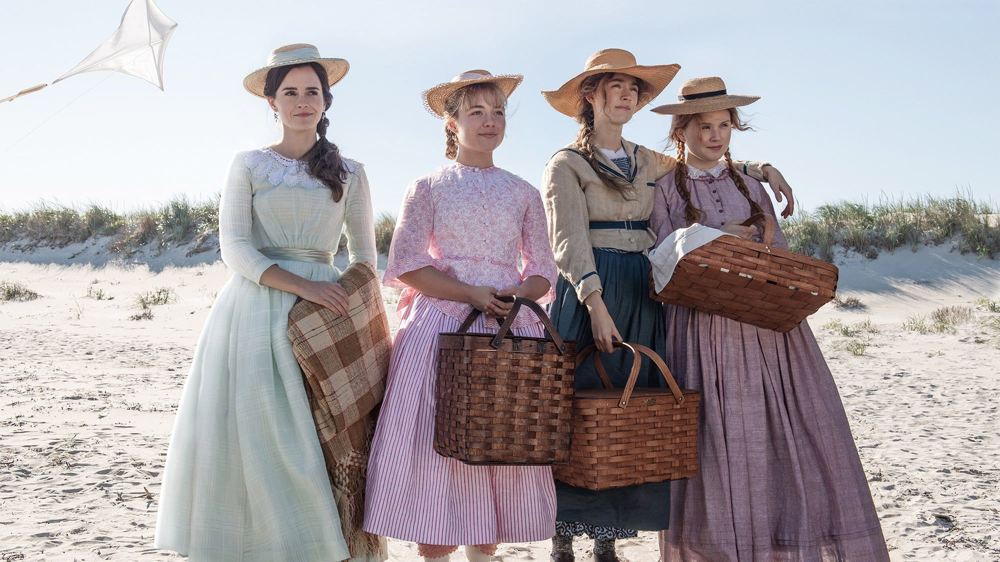
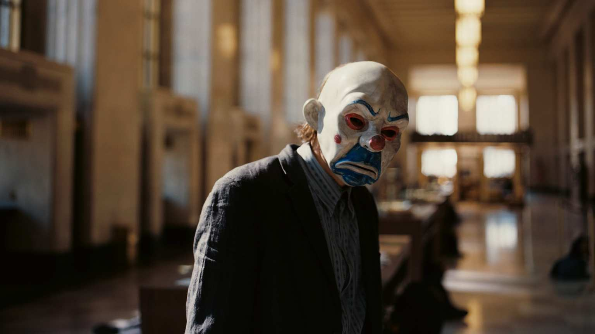
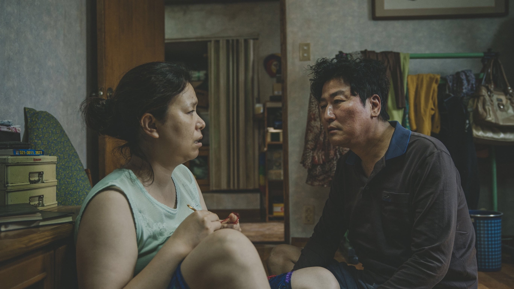
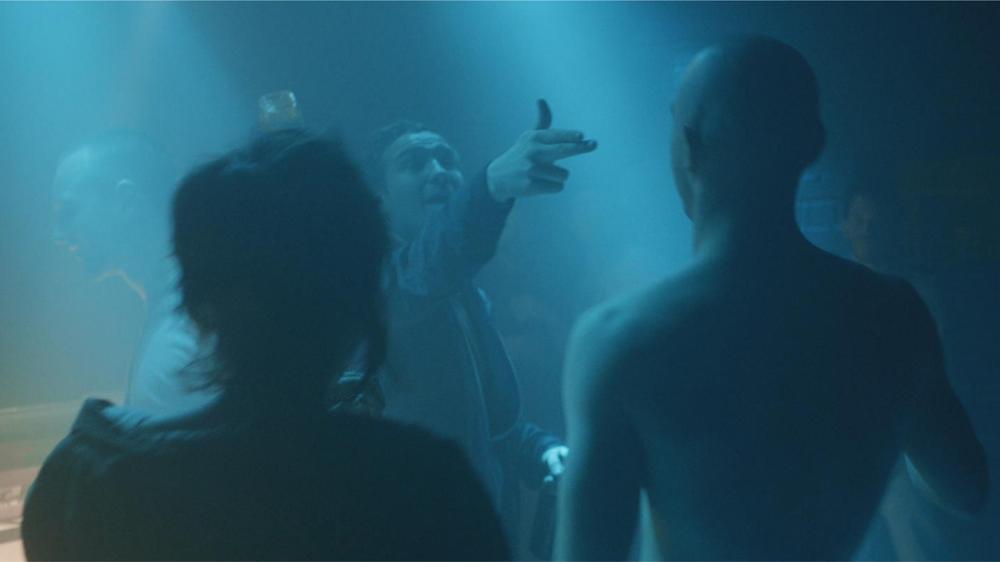
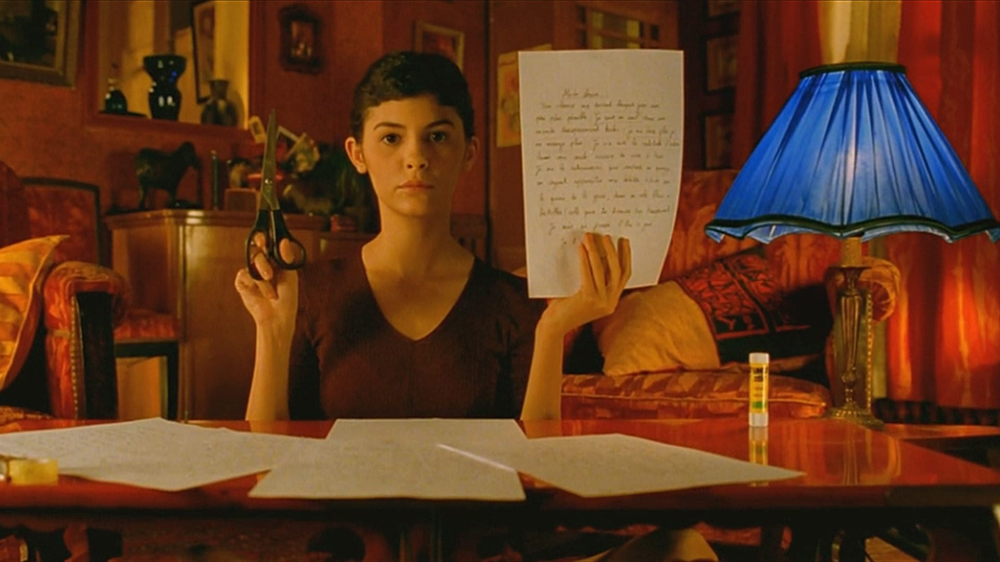

import Film from "../../../src/components/Film"
import FilmCover from "../../../src/components/FilmCover"
import Grid from "../../../src/components/Grid"

Oh film, the wondrous man made creation that constantly breaks down boundaries and explores the limits of human emotion how I love thee. Those of you that know me will know that I love everything film, I think it's one of humankinds greatest achievements and is pioneered by some exceptional people, serving us up an absolute feast for our eyes. I find it difficult to pin point the "wow" moments in my life but I know a lot of them are rooted in film and losing myself in completely different narratives.

I felt it important to start to document what I have appreciated the most over time and this is the first one to sit within this space. As well as my top 5 I will also add some worthy contenders below because in all honesty on another day they could easily fall within my top 5.

<Film cover="./covers/little_women_cover.jpg" title="Little Women" year="2016" genre="Drama, Romance" rating={5}>

The love and care that is oozing out of this film is so strong and beautiful you can't stop grinning and wishing those moments upon yourself. Never before have I experienced something so pure and honest on the screen that I was drawn into the whirlwind of emotions that is Little Women. An incredibly group of enchanting characters each trying to own their own story and make something of themselves, unaware of the sacrifices they will have to endure and the bonds that will be broken. It is beautiful, celebratory and exuberent in a way every film should be, Greta Gerwig really outdid herself with this film and it earned every one of those stars.
</Film>

<Film cover="./covers/dark_knight_cover.jpg" title="The Dark Knight" year="2008" genre="Drama, Action, Crime, Thriller" rating={4.5}>

"You either die a hero, or live long enough to see yourself become the villain." An Exhilerating and riverting 152 minutes of pure joy and everything a superhero film should be. The opening bank robbery scene will forever be one of my favourites and who can forget Heath Ledgers mesmerising performance. Forget a spoon full of sugar, introduce a little anarchy and watch Gotham City come to life.
</Film>

<Film cover="./covers/parasite_cover.jpg" title="Parasite" year="2019" genre="Comedy, Thriller, Drama" rating={4.5}>

Expectations were already high, but fuck me it's even better than I anticipated. Forget about genres, Parasite flat out refused to fit the narrow parameters of any existing classification. As beautiful and well executed Parasite is at face value Boon Jong Ho also encourages us to look at the underlying socio political issues currently being experienced in Korea while also critiquing the limited and ignorant perspective of the wealthy, a must watch for those who want something brilliant and enjoy some minimalist architecture now and then.
</Film>

<Film cover="./covers/victoria_cover.jpg" title="Victoria" year="2015" genre="Crime, Thriller, Romance" rating={4.5}>

Filmed in one continuous take and made all the more believable by excellent performances from it's cast, Victoria is a triumph in filming processes and work ethic. I read that the script for the film only consisted of 12 pages with most of the dialogue being improvised by the actors and subconsciously we embrace that. The levels of reality become indistinguishable from your own and you live through the characters, experience their moments and feel their emotions. I already loved Berlin as a city but Victoria makes me like it that little bit more.
</Film>

<Film cover="./covers/amelie_cover.jpg" title="Amelie" year="2015" genre="Crime, Thriller, Romance" rating={4.5}>

Amelie really is the movie equivelent of being hugged. It's a beautifully crafted and equisitively narrated tale about the simple things in life and really succeeds in making us pause the appreciate the small wonders that surround us in the everyday. It is by far one of the most joyous idiosyncratic and downright fun movies I have ever watched and I long to find another film that makes me feel this way and I'll admit I'm almost residing to the fact that film may not exist.
</Film>

<h2>Worthy Contenders</h2>

Any of the below could realistically slip into the top 5 depending on what mood I'm in but even if you don't agree it'll be a good movie you can watch. So in no particular order:

<Grid gridTemplateColumns="repeat(auto-fill, minmax(120px, 1fr))" gridGap="1rem">
	<FilmCover cover="./covers/joker_cover.jpg" year="2019" genre="Crime, Thriller, Drama" rating={4.5} />
	<FilmCover cover="./covers/her_cover.jpg" year="2013" genre="Romance, Science Fiction, Drama" rating={4.5} />
	<FilmCover cover="./covers/midsommar_cover.jpg" year="2019" genre="Horror, Drama, Mystery " rating={4.5} />
	<FilmCover cover="./covers/grand_budapest_cover.jpg" year="2014" genre="Comedy, Drama" rating={4.5} />
	<FilmCover cover="./covers/blade_runner_2049_cover.jpg" year="2017" genre="Science Fiction, Drama " rating={4.5} />
	<FilmCover cover="./covers/whiplash_cover.jpg" year="2014" genre="Drama, Music" rating={4.5} />
	<FilmCover cover="./covers/1917_cover.jpg" year="2019" genre="War, Drama, Action, History" rating={4.5} />
	<FilmCover cover="./covers/lobster_cover.jpg" year="2015" genre="Comedy, Romance, Science Fiction" rating={4.5} />
	<FilmCover cover="./covers/intouchables_cover.jpg" year="2011" genre="Comedy, Drama" rating={4.5} />
</Grid>

