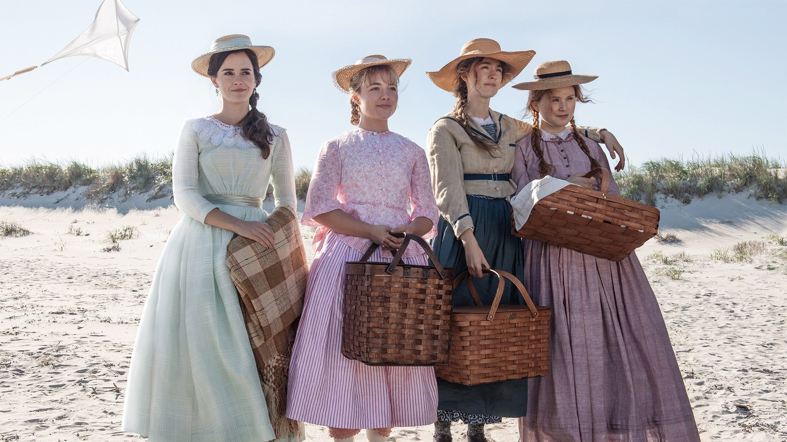

import Film from "../../../src/components/Film"

This week I had my first play around with Gutenberg blocks and created my first block (it was a wild ride...). In this post, I thought I would give a little insight into the process of creating a block and some of the headaches I experienced along the way. One important thing to note is that none of this would have been possible without all of the hard work put into the `create-guten-block` open source project so a big thanks to those guys. Okay, now the small talk is over with lets jump right in.

<Film cover="./covers/little_women_cover.jpg" title="Little Women" year="2016" genre="Drama, Romance" rating={5}>

This week I had my first play around with Gutenberg blocks and created my first block (it was a wild ride...). In this post, I thought I would give a little insight into the process of creating a block and some of the headaches I experienced along the way. One important thing to note is that none of this would have been possible without all of the hard work put into the `create-guten-block` open source project so a big thanks to those guys. Okay, now the small talk is over with lets jump right in.
</Film>

<Film cover="./covers/dark_knight_cover.jpg" title="The Dark Knight" year="2008" genre="Drama, Action, Crime, Thriller" rating={4.5}>

Let's start writing some cool stuff about the film
now lets start writing some stuff
</Film>
