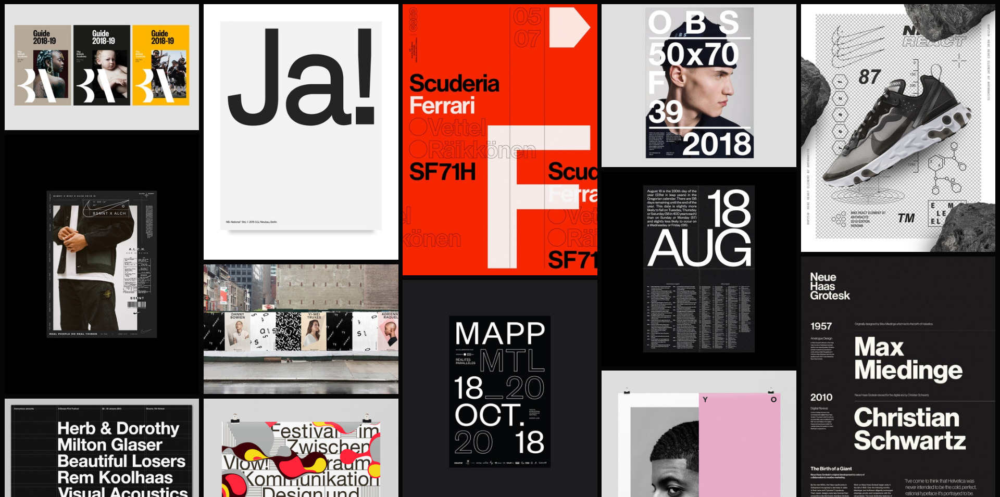

Having a lack of inspiration can drag any project down and make for some lack luster design decisions. Here are some sites and other resources to kickstart some ideas when tackling a new project.

## Curated sites

- [Admire the Web](https://www.admiretheweb.com/)
- [Best Website Gallery](https://bestwebsite.gallery/)
- [Hover States](https://www.hoverstat.es/)
- [Klikkentheke](https://klikkentheke.com/)
- [Minimal Gallery](https://minimal.gallery/)
- [Site Inspire](https://www.siteinspire.com/)
- [The Gallery](https://thegallery.io/)
- [The Responsive](http://the-responsive.com/)

## Savee Collections

I've used [Savee](https://savee.it) for a while now and I absolute love it. I've grown tired of forgetting where I saw that good thing that one time, so now these collections act as an extension of my visual memory.

### Print

Any interesting type or adventurous layouts will be added into this collection.

### Web

Those beautiful web layouts and good uses of type and imagery will live here. Sometimes it will just be an element of the screen which I will note in the info tab.

### Interactions

If I come across any interaction that excites me or put my skills to shame, they will be found in here. I use [Kap](https://getkap.co/) to grab all of the screen recordings in GIF format.

